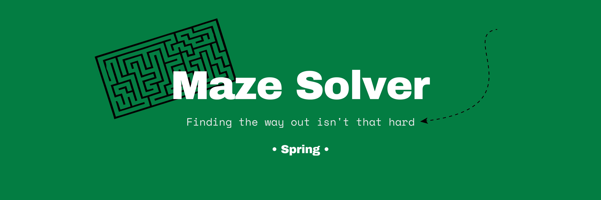
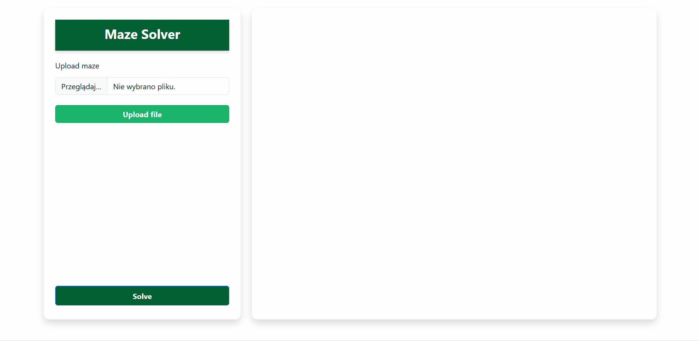

**Live Demo:** https://maze-solver.up.railway.app/

Maze Solver is a Spring Boot web application that solves mazes uploaded by users as text files.

The application uses the Breadth-First Search (BFS) algorithm to find the shortest path between start and end points selected by the user and visualizes the result in the maze.

## Demo

## Project Status
The core functionality is complete, and the project is under active development with a focus on improving code quality, structure, and user experience.

